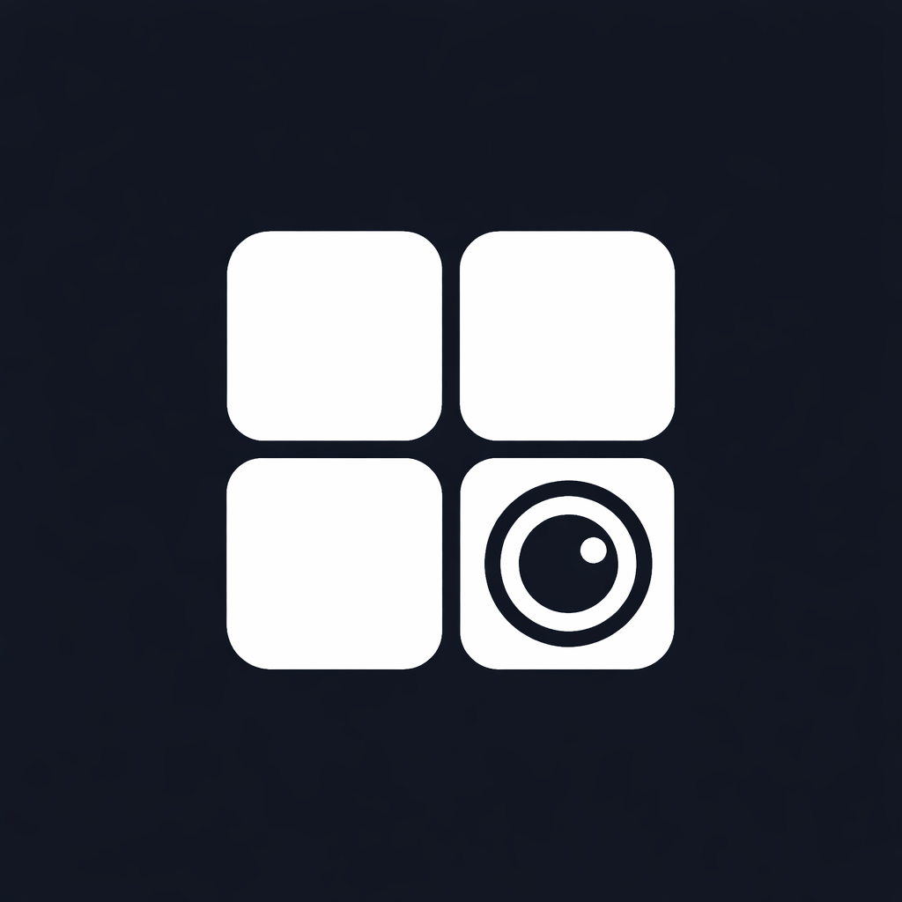
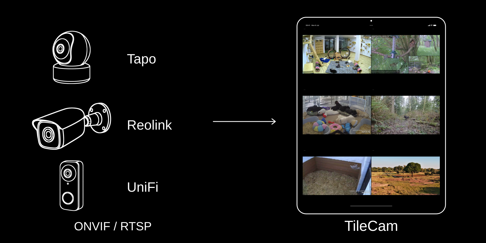
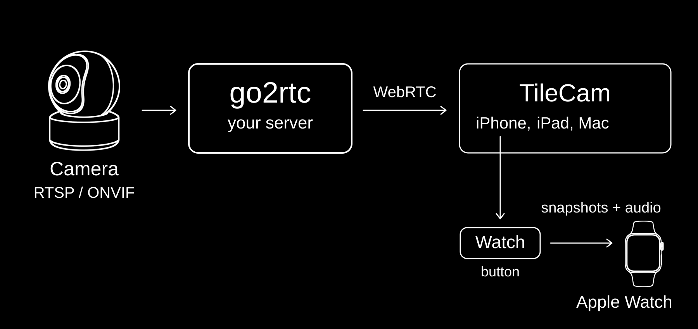

<p align="center">
  
</p>

<h1 align="center">TileCam</h1>

<p align="center">Watch every camera from your go2rtc server in one live grid, on iPhone, iPad, Mac and Apple Watch.</p>

<p align="center"><strong>Coming soon to the App Store.</strong> Until then, you can <a href="#build-from-source">build it from source</a>.</p>



## Getting started

1. **Set up go2rtc.** TileCam shows the cameras on your own
   [go2rtc](https://github.com/AlexxIT/go2rtc) server. Add your cameras to go2rtc first.
   Anything go2rtc can read works: Tapo, Reolink, UniFi, Amcrest, Hikvision, or any ONVIF
   or RTSP camera.
2. **Install TileCam.** It is coming soon to the App Store for iPhone, iPad and Mac. Until
   then, [build it from source](#build-from-source).
3. **Open TileCam and enter your server's address**, for example
   `http://192.168.1.100:1984`. Tap **Test**. TileCam shows how many streams it found.
   Then tap **Connect**.
4. **Allow local network access** when iOS asks. TileCam needs it to reach your server.
   If you declined, turn it on in the Settings app under TileCam. Until then TileCam shows
   **Cannot reach server** with a **Retry** button.
5. **Tap a camera name at the bottom of the screen.** Its live video appears as a tile.
   Tap more names to add more tiles.

TileCam needs iOS 17, macOS 14 or watchOS 10 or later. The App Store installs updates.

## Use

Tap anywhere to show or hide the controls.

| To | Do this |
|---|---|
| Zoom into a camera | Pinch the tile, then drag. TileCam remembers where you left each camera. |
| Go back to the full view | Tap the recenter button on the tile. |
| Mute or unmute a camera | Press and hold its tile. |
| Mute everything | Tap the speaker button at the top. |
| See motion | Tap the motion button on a tile: **Breathing** makes small movements larger, **Motion Flow** shows which way things move, **Heat Map** shows where. |
| Keep watching in another app | Leave TileCam. The camera keeps playing in Picture in Picture. Close that window to stop. |
| Send a camera to Apple Watch | Tap the Watch button on its tile. |

**Settings** has **Keep Screen Awake**, **Dim Video** for night viewing, and
**Background Audio**.

The Apple Watch app is a one-time purchase, with Family Sharing. Buy or restore it from
**Watch settings** in the iPhone app. Its options:

| Setting | Options |
|---|---|
| Default Mode | Video + Audio, Video Only, Audio Only |
| When you lower your wrist | Pause, Listen, Stay On |
| Auto-Timeout | Off, 15 min, 30 min, 1 hour, 2 hours |

## How it works



TileCam never talks to your cameras. It asks go2rtc for its list of streams, and go2rtc
turns each camera into a WebRTC stream that TileCam plays in a tile. Video goes straight
from your server to your device. Nothing passes through RainnWorks, and the app collects
no data. The Apple Watch cannot play WebRTC, so the iPhone fetches snapshots and audio
from go2rtc and sends them to the Watch.

## Limits

- **You need a go2rtc server.** TileCam cannot connect to a camera or a camera maker's
  cloud by itself.
- **Watching away from home needs your own route to the server,** such as a VPN.
  TileCam does not provide one.
- **No recording and no alerts.** TileCam shows live video only.
- **Audio is listen only.** You cannot talk through a camera.
- **Apple Watch needs its iPhone nearby,** because the iPhone sends it the video.
- **Dark mode only.**

## Build from source

```sh
brew install xcodegen
xcodegen generate
open TileCam.xcodeproj
```

Build the `TileCam` scheme. Things that surprise:

- **The Xcode project is generated** from [`project.yml`](project.yml). Do not edit the
  `.pbxproj`. Add new files to the right folder under `GlassView/` or `TileCamWatch/`,
  then run `xcodegen generate` again.
- **You need Xcode 26.** The app uses iOS 26 Liquid Glass behind an availability check,
  so it needs the iOS 26 SDK to compile, even though it runs on iOS 17.
- **Change the bundle IDs and team to your own** before you run on a device:
  `works.rainn.tilecam`, `works.rainn.tilecam.watchkitapp` and `DEVELOPMENT_TEAM` in
  `project.yml`.
- **The Watch unlock is free in your own builds.** Debug runs use
  [`TileCam.storekit`](TileCam.storekit), so the purchase costs nothing. Once TileCam is on
  the App Store, buying the unlock there supports the project.

To check that it compiles without signing:

```sh
xcodebuild -project TileCam.xcodeproj -scheme TileCam \
  -sdk iphoneos -configuration Debug build CODE_SIGNING_ALLOWED=NO
```

## Release

Set `MARKETING_VERSION` in `project.yml` for both app targets, commit, then push a
matching tag:

```sh
git tag v1.0 && git push origin v1.0
```

GitHub Actions then:

1. signs with the RainnWorks App Store certificate, through
   [`RainnWorks/apple-signing`](https://github.com/RainnWorks/apple-signing),
2. builds the app with the Watch app inside it, using the run number as the build
   number,
3. uploads it to TestFlight.

Submitting for review is done by hand in App Store Connect. Metadata and screenshots
live in [`fastlane/`](fastlane/). See [`fastlane/SETUP.md`](fastlane/SETUP.md) for the
lanes and secrets.

## License

Source available under the [PolyForm Noncommercial License 1.0.0](LICENSE). You can
build, change, run and share TileCam for any noncommercial purpose. Commercial use is
not granted. TileCam is not affiliated with go2rtc.
